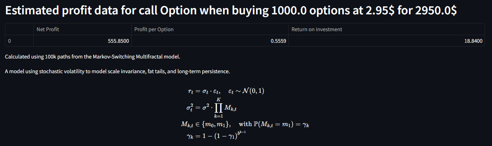
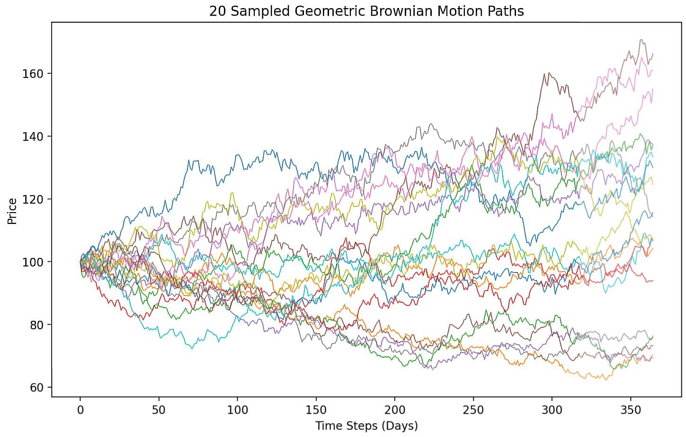
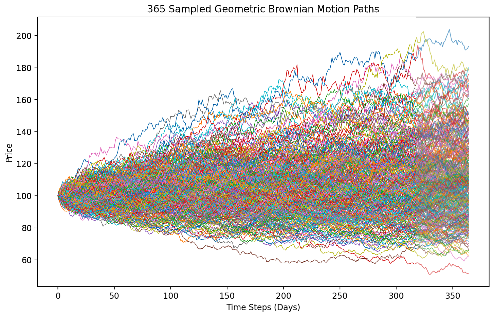
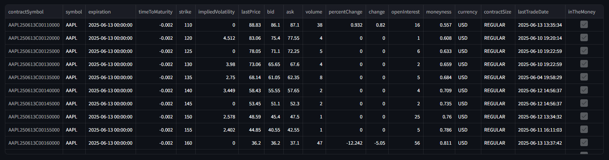
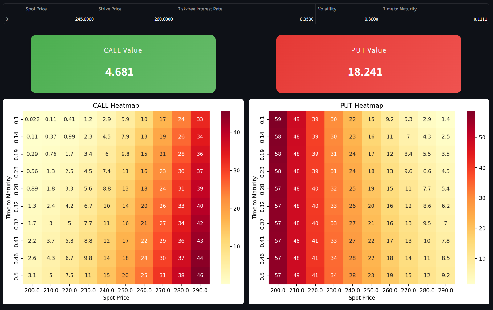

# Option Pricing Framework

## Overview
This project is a modular framework for option pricing and simulation, allowing the flexible application of various valuation models including:

- Black-Scholes-Merton (BSM) model
- Markov-Switching Multifractal (MSM) model

The system is built to analyze and simulate option prices under both constant and time-varying volatility regimes, supporting both academic exploration and real-world prototyping.

## Graphical User Interface
The framework now includes a complete GUI that provides access to:

- Interactive model testing and validation
- Visual path simulation monitoring
- Real-time matrix construction
- Performance analytics dashboard

[Learn about GUI features](docs/gui_guide.md)

### TL;DR:
1. Install requirements
2. Move inside /main 
3. Run scripts/open_gui.py

```bash
pip install -r requirements.txt
cd main
python -m streamlit run scripts/open_gui.py
```

## Supported Models
### Black-Scholes-Merton (BSM)
Standard European option pricing with constant volatility.

### [Markov-Switching Multifractal (MSM)](docs/msm.md)
Volatility evolves via discrete regimes, switching over time. Simulates heteroskedastic returns and long-memory volatility.

## Key Features
### [Model Performance Testing](docs/testing.md)
- Validate model accuracy against theoretical values
- Compare different model implementations


### [Memory-Mapped GBM Path Generation](docs/path_generation.md)
<p float="left">



- Generate millions of Geometric Brownian Motion paths efficiently
- Low-RAM operation via memory mapping technology
- Fully configurable parameters

### [Option Data Processing](docs/data_processing.md)

- Fetch and clean option chain data
- Convert data into a standardized format for analysis and simulation


### [Matrix Construction Toolkit](docs/matrix_builder.md)

- Create custom option pricing matrices that show fair prices across configurable ranges
- User-defined variable mapping for BSM inputs


## Planned Extensions
Calibration comparison between models

American option support

Greek calculations (Delta, Gamma, Vega...)

## Academic Foundations
Black, F., & Scholes, M. (1973). The Pricing of Options and Corporate Liabilities.

Calvet, L. E., & Fisher, A. J. (2004). Forecasting Volatility using MSM models.

Hull, J. C. (2017). Options, Futures, and Other Derivatives.

---

> _"In trading, the illusion of simplicity often hides a jungle of uncertainty. May this repo help you explore it wisely."_ 🌱